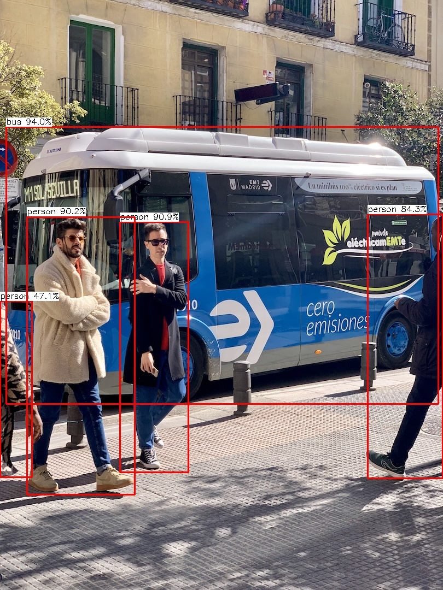

# yolov10-ncnn
  ncnn deploy yolov10 

## Requirements
* cmake 
* OpenCV
* ncnn

## build
``` 
mkdir build
cd build 
cmake ..
make -j4
```

### usage

1. detect image  
./build/yolov10_ncnn 0 ../img/bus.jpg

<p align='center'>
  
</p>

2. detect video  
./build/yolov10_ncnn 1


### reference 
1. https://github.com/THU-MIG/yolov10
2. https://github.com/zhouweigogogo/yolov10-ncnn
3. https://github.com/Tencent/ncnn